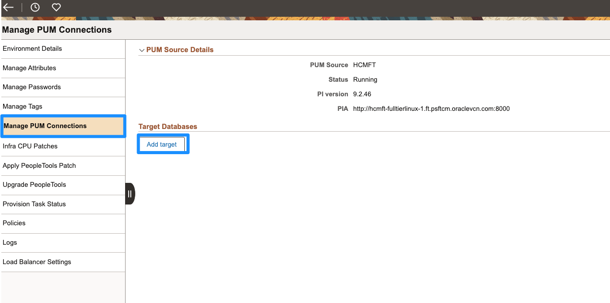
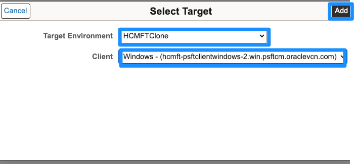
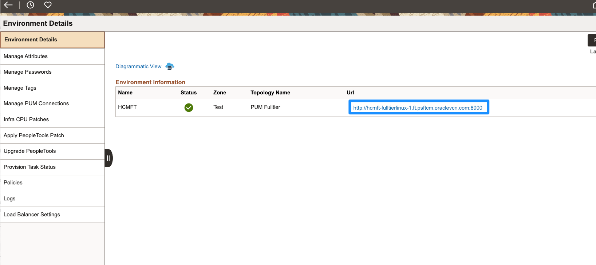
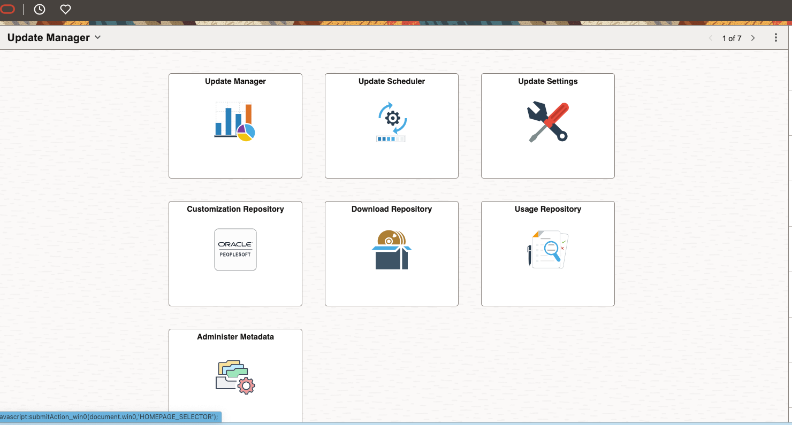
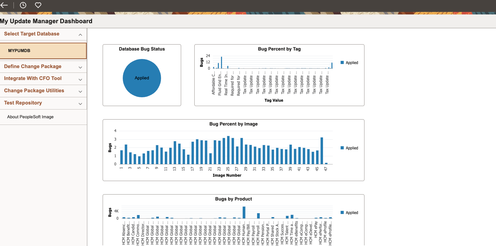
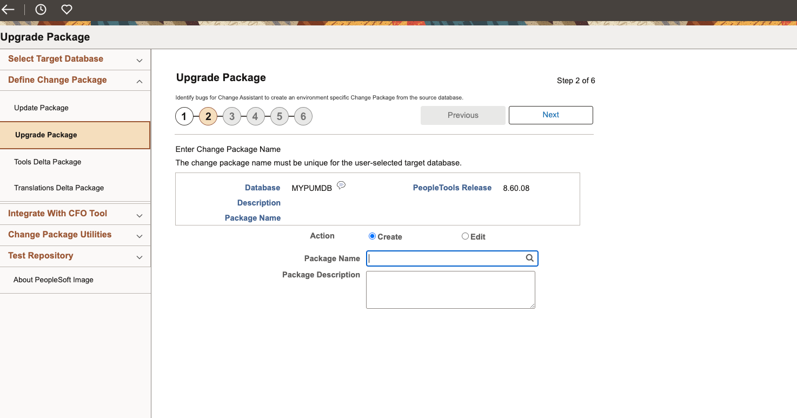

# Selective Adoption

## Introduction
Cloud Manager enables customers to take advantage of Selective Adoption by quickly creating PUM environments in Oracle Cloud and automating configuration of target databases in PUM source. Once target databases are configured, standard procedure should be followed to apply updates to target environments. For additional information on selective adoption please visit [https://docs.oracle.com/cd/F40091_01/psft/pdf/pcd858cmif-b032021.pdf](https://docs.oracle.com/cd/F40091_01/psft/pdf/pcd858cmif-b032021.pdf) and navigate to Chapter 9.

Estimated Lab Time: 30 minutes

### Objectives
In this lab you will:
* Create a PUM Connection from one PeopleSoft environment to another

### Prerequisites
- Two PeopleSoft environments up and running. One that will be used as a source environment and one that will be used as a target environment. The source environment must have a newer image version than the target environment.

## Task 1: Create PUM Connection

1.  Navigate to **Dashboard** > **Environments**. On your source environment click the down arrow button and then click **Details**.
    

    Click **Manage PUM Connections** on the side menu then click **Add Target**.
    

2.  Select your desired target environment and for client select the Windows client. Click **Add**.
    

    Under **Target Databases** you should now see your new PUM connection. Notice how under **Upload target to PUM Source** the status is **in progress**. Wait until the status says **COMPLETE**, then you can move on to the next step.
    

## Task 2: Logging into PUM Source

If you want to apply packages to the target DB you can use the PIA URL to log into the PUM source and manually apply a change package. 

1.  Navigate to **Dashboard** > **Environments**. On your source environment click the down arrow button and then click **Details**. 
    

    On the side menu click **Environment Details** and then click on the URL.
    

    Enter your User ID (**PS** if you are using an HCM instance) and Password to sign in.
    

2.  Click the navigation icon in the top right to open the navigation menu.
    

    Navigate to **PeopleTools** > **Lifecycle Tools** > **Update Manager** > **Update Manager Dashboard**.
    

    From here you will be able to see the uploaded target DB information.
    

    From **Define Change Package** on the side menu you will be able to apply packages to the target DB.
    

You may now **proceed to the next lab.**

## Acknowledgements
* **Authors** - Deepak Kumar M, Principal Cloud Architect; Sara Lipowsky, Cloud Engineer
* **Contributors** - Edward Lawson, Master Principal Cloud Architect; Megha Gajbhiye, Principal Cloud Architect
* **Last Updated By/Date** - Ziyad Choudhury, Principal Cloud Architect, August 2023